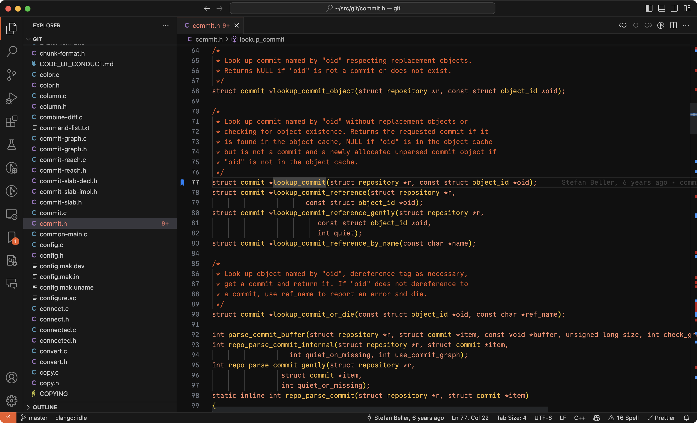

# P3 Theme for Visual Studio Code

A minimal dark theme for Visual Studio Code inspired by the amber colors seen on
the [monochrome monitors](https://en.wikipedia.org/wiki/Monochrome_monitor) of
the 80s.

It follows few simple principles[^1]:

- Reduce visual noise by using a limited color palette.
- Recognize the importance of code comments by making them more prominent.
- More emphasis on identifiers and literals, less on language keywords.
- Everything else should fade into the background.

## Installation

1. Go to **Extensions**
2. Search for "**P3 Theme**"
3. Install

## Related projects

- [P3 Theme for iTerm2](https://github.com/nvartolomei/iterm2-theme-p3)

[^1]: These principles are inspired by the
    [Alabaster Theme](https://github.com/tonsky/vscode-theme-alabaster/blob/2e34731b0f2190dcb2875d6f46966cea760c3fe8/README.md#motivation).
    I recommend trying it out if you are looking for a light alternative.
